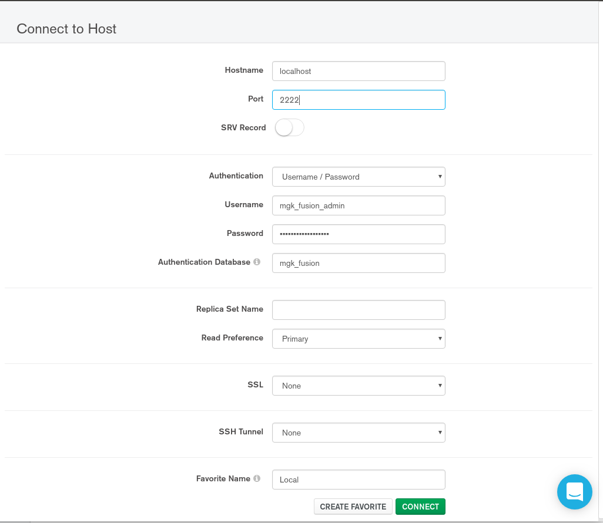

## Play it locally

1. Download [MongoDB](https://www.mongodb.com/what-is-mongodb) and install it according to the [documentation](https://docs.mongodb.com/manual/administration/install-community/). If you would also like a gui, you can also download [MongoDB Compass](https://www.mongodb.com/products/compass)

2. If successfully installed, you are probably now in mongo shell environment. You can now create a local database (For test) by   
```
   use mgk_fusion  ----- % create an empty database with name 'mydb'   

   db.createUser(   
    {   
     user: "username",  % create user name  
     pwd: "password", % create user pass  
     roles: [ "dbOwner" ] % assign role  
    }   
   
   db.auth(username, pass)   % authenticate a user    
```  

3. [Cheat sheet](https://blog.codecentric.de/files/2012/12/MongoDB-CheatSheet-v1_0.pdf) and [a sql-comparison](https://docs.mongodb.com/manual/reference/sql-comparison/ )  

4. Update your created name and pass in the script `mgk_uploader.py` and run it to upload information from the test data into the database.  
   * You can check current uploaded collections by typing `show collections` in the mongo shell.   
   * You can check the summary dictionary by typing `db.LinearRuns.find().pretty()`.

5. The physical storage of large files are by [GRIDFS](https://docs.mongodb.com/manual/core/gridfs/). Since it is handled by Python in the backend in our case, [here](https://api.mongodb.com/python/current/api/gridfs/index.html) is the documentation for using it in pymongo

6. You can interacte with the database via at least 3 methods:  
   * [Mongo Shell](https://docs.mongodb.com/manual/mongo/)  
   * [Pymongo](https://api.mongodb.com/python/current/api/index.html)  
   * The GUI, such as MongoDB Compass.  
   

7. Some example queries:  
   * `db.LinearRuns.find({"Parameters_dict.kymin": {$lt: 20}}).count()`   
   * `db.LinearRuns.find({"Parameters_dict.kymin": 160},{"Parameters_dict.kymin":1})`    
   * `db.fs.files.find({$text:{$search : "\"autopar_0013\""}}).pretty()`   
   (text index needs to be created first. In mongo shell, type `db.collection.createIndex( { "$**": "text" } )` check [here](https://docs.mongodb.com/v3.2/core/index-text/) for details) 
  
8. Many parts are still under construction.   
   * Default QoIs to get from each run.  Need update in `get_QoI_from_run` in `mgk_post_processing.py` for adding these quantities.    
   * Integrity check.  
   * Put the database in a remote server and authentication management for different users.    
   * Other user interfaces such as a web based frontend.    
   * Visualizations after the scan and visualization option after querying the database.  
   * Compatibilities with other tools.

## on Cori

1. Cloning the repo via git.  
2. Load python3 via `module load python3`     
3. Run the uploader by `python3 mgk-dev/mgk_uploader.py -T /global/homes/d/dykuang/mgk-dev/data_linear_multi`.  Option -T is for specifying your target folder. Use option --help for display other options information.  
4. If you encounter "module not found" error. You can use `conda install`. For example, `conda install pymongo`.  
5. If this is the first time you upload files, it will ask you to type login credentials. You need to get a username and pass for the database. (Just email me with your preferred name and pass, I will then create read/write access for you).  
The default value for server, port, database name are:  **mongodb03.nersc.gov, 27017, mgk_fusion**. You will have the option to save the credential after you finished manually entering these info.
After you choose to save it. You can use `-A` option to locate your saved `.pkl` file to make uploads next time. For example `python3 mgk-dev/mgk_uploader.py -T /global/homes/d/dykuang/mgk-dev/data_linear_multi -A DK_mgk_login_admin.pkl`
6. If everything went smoothly, you will see informations like "... successfully" printed on terminal. If not, please shoot me an email with the error message, so that I can try to locate the error.  
7. You can also entering the mongo shell to check what is in the database now. Modify the following shell script and save it for your convenience.  
```
module load mongodb
mongo -u username -p pass mongodb03.nersc.gov/mgk_fusion
```  
   
8. If you had MongoCompass installed locally, you are also able to view the database locally following the instructions below.  
   * Forward the ssh tunnel port to a local port : `ssh -i .ssh/nersc -f YOURACCOUNT@cori.nersc.gov -L 2222:mongodb03.nersc.gov:27017 -N`. I used 2222 here, but you can use other port specifications.
    You will be asked to provide login credentials on cori for this.
   
   * At the start page, fill in fields as below:  
      
    
   * Click "connect".
     

